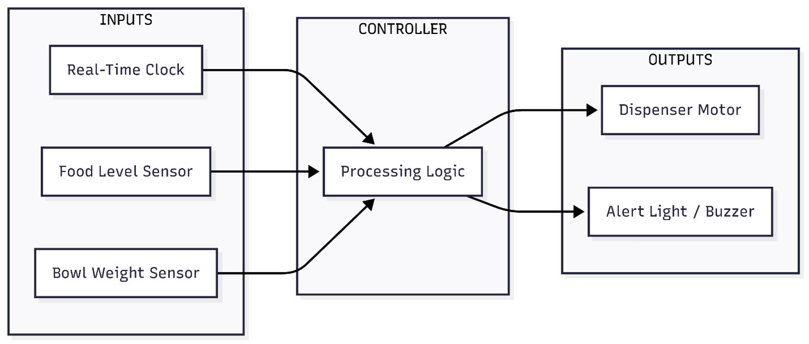

# Step 1: Problem Analysis

## Problem Definition
The initial one is to examine the problem, characterize the system core characteristics and define the boundaries of its operation. The importance of using such systems is increasing due to the soaring pet ownership and the demands of pet owners purchasing superior care products, producing increased growth on the Internet of Things (IoT) to treat pets.

## Problem Statement
The local animal shelter needs to be designed with a low cost, programmable automated pet feeder. The logic of the system should allow to release food to cats and dogs according to certain schedule, control whether the product has been consumed or not, and notify shelter personnel about any problems, including when a food hopper is left empty or a pet skipped his/her meal. Research by (Li, Shen, Cheng & Liu 2023) proves that smart pet appliances lessen the burden of pet care by making feeding more consistent and smarter. Moreover, their research demonstrates that these devices improve health and quality of life of both pet and their owners.

## Functional Requirements
There are some key features that the feeder needs to have and they are the basic considerations in contemporary pet care systems:
* **Scheduled Feeding**: Serve food two times daily at environments determined by the staff.
* **Portion Control**: The food it dispenses should be in a measured amount with each dispenser, which is a noteworthy issue in automated feeders, to stipulate that overfeeding or underfeeding is avoided.
* **Monitoring Consumption**: Note whether the pet consumes the food within a sensible period of time of feeder delivery.
* **Staff Alerts**: Notify the staff about emergency cases i.e. in case of food not being eaten or food is stored.

## System Block Diagram
Any automated system such as that requires a microcontroller such as Aurdino, in order to complete this system we are also using a microcontroller and following is the diagram below which shows the basic components and the flow of information. This architecture, centered on a microcontroller, is common in IoT-based pet feeders (Mulla et al., 2025, p. 639).

## Assumptions
* There will be a constant supply of power to the feeder.
* Single kind of dry pet food will be used.
* The feeder accepts only one pet at a time because the device lacks sensitive functions such as pet recognition with the help of a camera characteristic of more elaborate systems.

## References
Li, Q., Shen, X., Cheng, Z. & Liu, Y. 2023, ‘Design and implementation of intelligent pet feeding system’, *2023 IEEE 22nd International Conference on Trust, Security and Privacy in Computing and Communications (TrustCom)*, Exeter, United Kingdom, 15–17 Nov., IEEE, pp. 2629–2635, viewed 17 August 2025, <https://doi.org/10.1109/TrustCom60117.2023.00367>.

Mulla, A., Wakshe, P., Gharat, V., Chavan, A., Raut, N. & Shelke, U., 2025. 'Automatic Pet Feeder', *International Journal of Advanced Research in Science, Communication and Technology (IJARSCT)*, vol. 5, no. 1, pp.637-642. Available at: <https://ij

 
